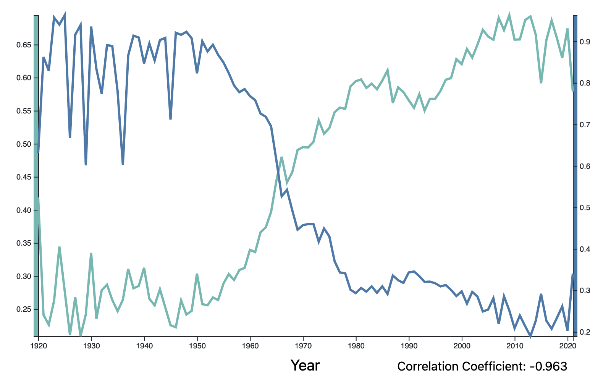
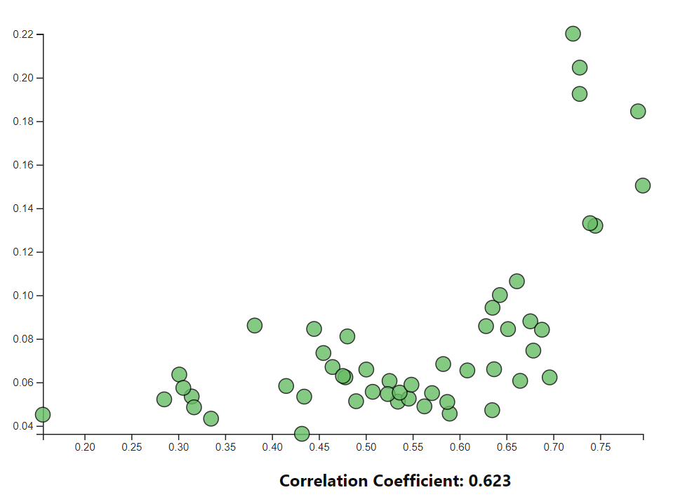
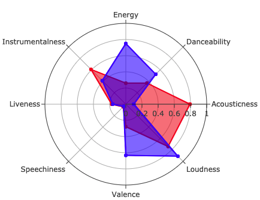

# Musical Attribute Analysis

The purpose of this project is to analyze the different attributes of songs and discover how they have changed over the years. In our research, we decided to plot our data using a multi-line chart to discover trends, plot a scatter chart to see relationships between attributes, and use a radar chart giving us the ability to compare artists of different eras.

The project is built as an interactive website with D3.js, Plotly.js, and Bootrap.js.

Website hosted here:
[Musical Attribute Analysis](http://zappa-75xn5ti4y.s3-website-us-west-1.amazonaws.com/index.html)

## Music Attributes

Spotify quantifies different music attributes for tracks in their libary.  The attributes can be described as follows:

|Attribute|Range|Description|
|-|-|-|
|Acousticness|0.0 to 1.0|A confidence measure of how acoustic a song is.|
|Danceability|0.0 to 1.0|How suitable for dancing using tempo, rhythem stability, beat strength, and regularity.|
|Energy|0.0 to 1.0|A measure of intesity and activity using tempo, loudness, and noisiness.|
|Instrumentalness|0.0 to 1.0|How confident that a song has no vocals.|
|Liveness|0.0 to 1.0|How confident that a song was performed in front of an audience. |
|Loudness|-∞ to 0|Negative values are how much restriction is placed on a given system. The closer it is to 0, the louder it is.|
|Speechiness|0.0 to 1.0|How much a song/track consists of entirely spoken words.|
|Tempo|0.0 to ∞ |The speed or pace of a given track. Given in Beats per minute.|
|Valence|0.0 to 1.0|How much positive emotion a song has.|

Source/Further Reading: [theverge.com](https://www.theverge.com/tldr/2018/2/5/16974194/spotify-recommendation-algorithm-playlist-hack-nelson)

## Data Source

This project is based on a Spotify dataset available on Kaggle.com:

[Spotify Dataset 1922-2021](https://www.kaggle.com/yamaerenay/spotify-dataset-19212020-160k-tracks)

## API

After data cleaning, the Spotify music data was compiled into a SQLite database.  Using the Python libraries SQLAlchemy and Flask, an API was constructed to handle queries to pull JSON-formatted data into each visualization. The API was deployed to AWS using Zappa.

The main API routes include:
- Data by Year - [/api/v1.0/data_by_year](https://zmyd1nzqug.execute-api.us-west-1.amazonaws.com/dev/api/v1.0/data_by_year)
  - Returns averaged attributes for tracks by year.  A total of 102 rows of data.
- Data by Artist - [/api/v1.0/top_51_genres](https://zmyd1nzqug.execute-api.us-west-1.amazonaws.com/dev/api/v1.0/top_51_genres)
  - Returns averaged attributes for tracks by genre.  A total of 51 rows of data.  List of top 51 genres determined by scraping popular music genres from Google.
- Data by Artist - [/api/v1.0/data_by_artist_clean/&lt;artist&gt;](https://zmyd1nzqug.execute-api.us-west-1.amazonaws.com/dev/api/v1.0/data_by_artist_clean/The%20B-52's)
  - Returns averaged attributes for tracks for a single artist.  28,680 artists are available in the SQLite database.
  - When adding the artist name at the end of the URL (replace "&lt;artist&gt;" with your artist of interest), please use the correct spelling, puncutation, capitalization, and spacing.  Note any accents or special characters (she's Beyoncé, not Beyonce).

Full set of API routes available [here](https://zmyd1nzqug.execute-api.us-west-1.amazonaws.com/dev).  Note that not all routes are optimized for speedy returns via AWS Lambda, so there may be timeout errors.

## JavaScript Library: statistics.js

Correlation coefficients between different attributes were calculated using the [statistics.js](https://thisancog.github.io/statistics.js/index.html) library.

## Musical Attributes Over Time

A line plot with multiple Y-axes, which are labeled with the selected attributes.  Use the drop-down menus on either axis to load in a new attribute for comparison over time.  Y-axes will scale as new attributes are selected, and are color coded to make it easier to track which attribute is which.  The correlation coefficient is displayed at the bottom of the plot.

## Musical Attributes By Genre

A scatter plot with drop down menus on the X and Y axis.  Attributes are averaged for each genre.  As new attributes are selected, the scatter plot will update to reflect the new axes.  The axes will also scale to the newly selected attributes.  Hover your cursor over individual circles in the plot to see the name of the genre and the values of the attributes.  The correlation coefficient is displayed below the graph, and the color of the scatter plot is updated to match the correlation coefficient (-1 is very red, +1 is very green, and values close to 0 tend to be more yellow.)

## Artist Radar Chart

Compare the attributes of two different artists by entering their names in the forms provided above the chart.  

## Observations

Based on our visualizations, we have the following observations:

- There is a drop in acousticness over time, which may be due to technological advancement for instruments and a growth in the use of amplified music, track production, and electronic instruments.
- Valence (happiness) and tempo have a very weak linear relationship when summarized by genre.
- Valence (happiness) and instrumentalness are inversely related; the happier a song is, the less likely it is to be a primarily instrumental track.  Perhaps songs that are purely instrumental like movie scores are determined to be sadder songs by Spotify's algorithm.
- Energy (culmination of loudness and tempo) and acousticness also exhibit an inverse relationship.  It is possible that acoustic songs tend to have lower volume and may have a slower pace, so the energy score tends to be lower based on Spotify's method for determining the energy.
- Music trends seem to change over time, and may be influenced by historical events.  Valence (happiness) seems to dip during WWII, and dips significanly again during the Great Reccession in the late 2000s.
- Similar artists have similar shapes on the radar chart.  Try plotting Fall Out Boy vs Panic! At The Disco or Wolfgang Amadeus Mozart and John Williams.  

## Limitations
While we've spent a lot of time putting together these visualizations and observations, there are still opportunities to improve:
- It is difficult to know if some of the correlations we are seeing in the data are due to bias or unknown methods that could influence the way Spotify assigns a value to these attributes.  Many of the attributes have a scalar value from 0 to 1; additional analysis is needed to see if there is any nuance in these values.
- Our scope of data exploration may limit our observations.  As we dive deeper into this dataset, there are more questions we'd like to look at.
  - Does the time period that an artist is active have an impact on their attribute values?
  - Does Spotify's algorithm capture changes in an artist's style or tone if they are active over a long period of time?
  - Do songs in similar keys have similar valence/tempo/energy etc.?
- Last but not least, correlation is not causation.  While many of these attributes have strong positive or negative correlations, it is difficult to conclude the cause for these relationships.  They may be due to common tendencies in music for different time periods, genres, or artists, OR there could be some bias in the dataset.

## Our Team

This project was built with grit, laughter, and caffeine by:

[alexdanieldelcampo](https://github.com/alexdanieldelcampo/)

[sabrinawjo](https://github.com/sabrinawjo)

[ytran010](https://github.com/ytran010)

[jakemperry](https://github.com/jakemperry)
